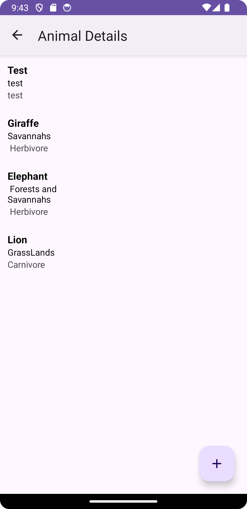
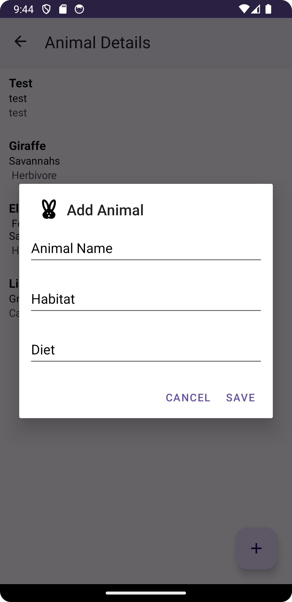
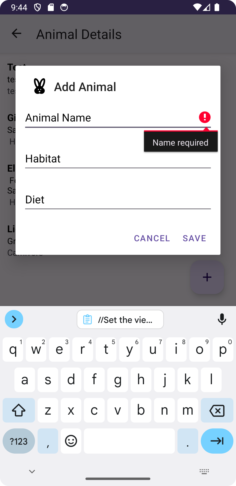
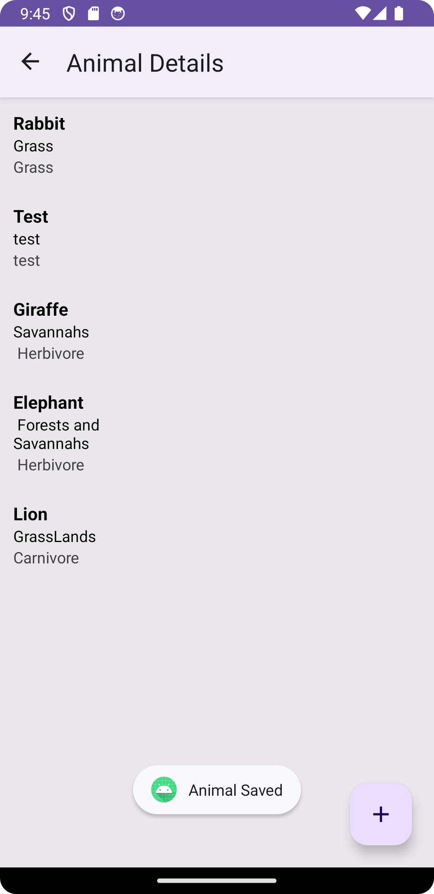
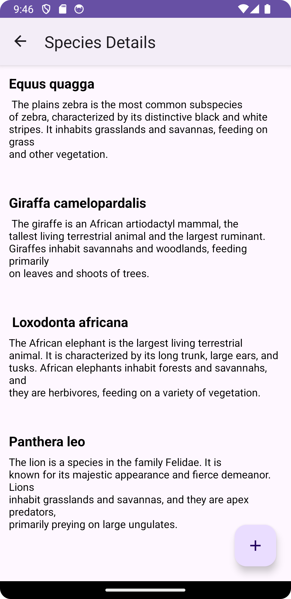
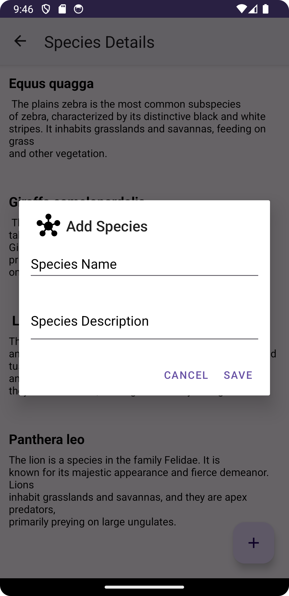
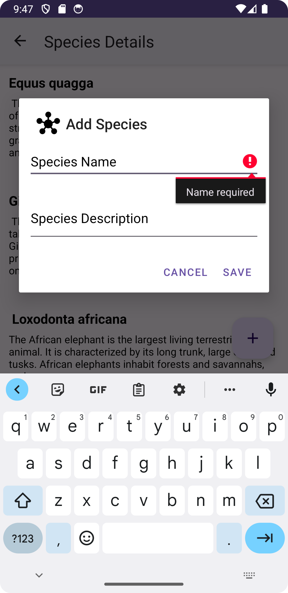
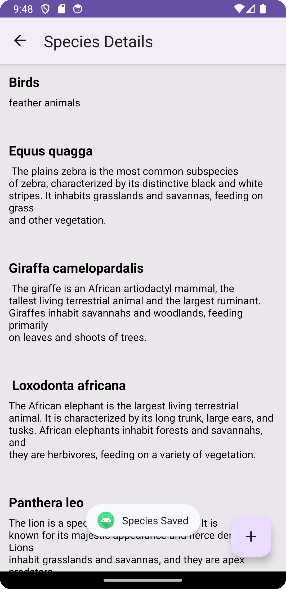

Animal Kingdom Explorer App
The animal kingdom explorer App allows to you select between two detail views
the animal and species details view. On clicking the animal details view, you will be taken
to a the view and a list of animals will display. To add a new animal click on the floating action
button at the bottom right of the screen, and enter all the details in the fields and click save. The entry shall
now display in the list.

On clicking the back arrow in the navigation bar at the top left, it will take you to the previous view
where you can then click on the species details view. This view displays different species and a description about them.
to add a new species, click on the floating action button at the bottom right of the screen, 
and enter all the details in the fields and click save. The entry shall now display in the list.

Dashboard View

Animal Details View

Adding a new animal

All fields are not filled so an error message is displayed

Animal Saved Successfully

Species Details View

Adding a new species

All fields are not filled so an error message is displayed

Species Saved Successfully
